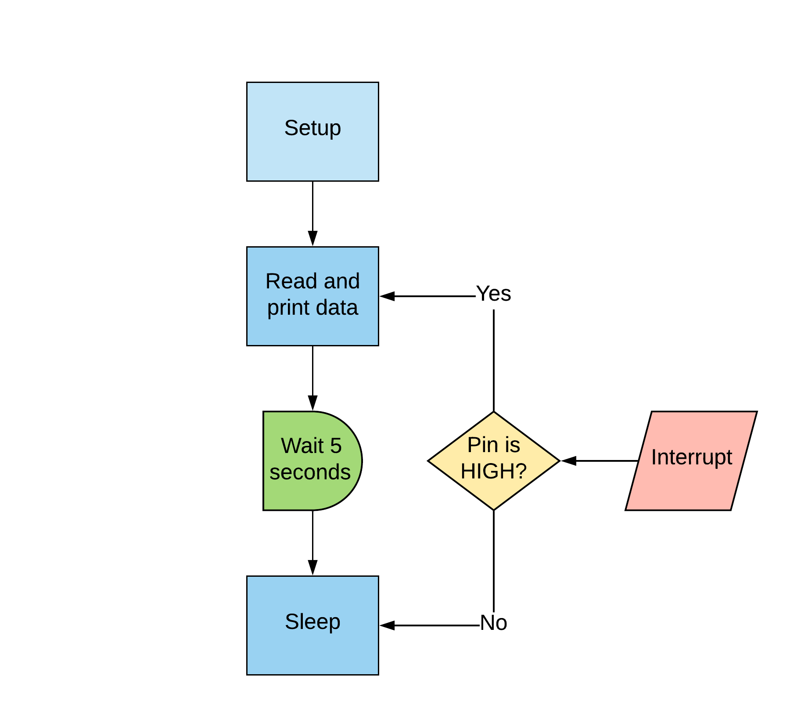
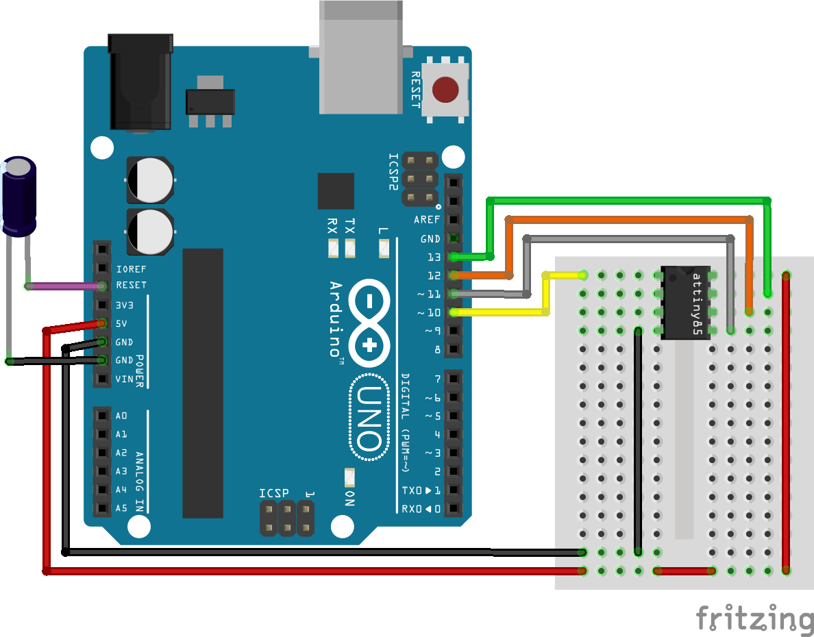
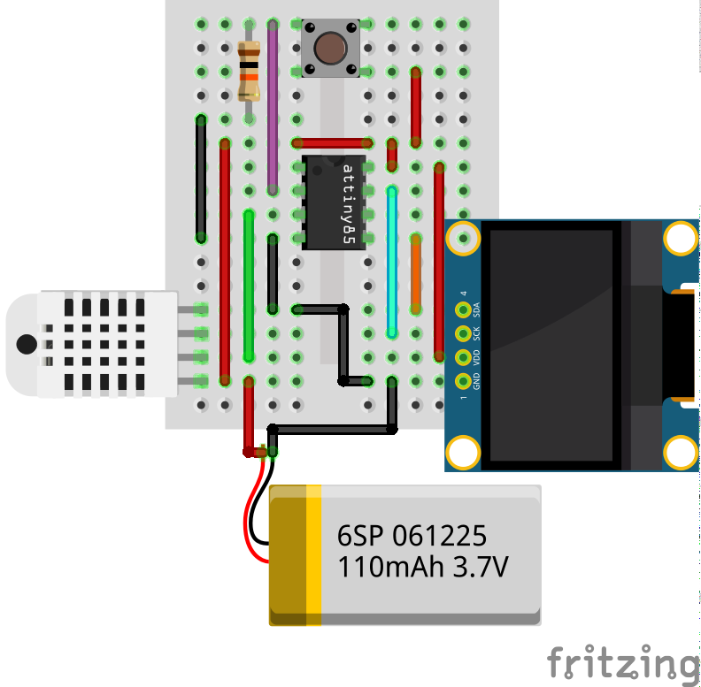
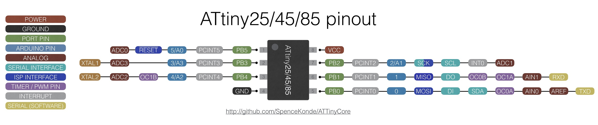
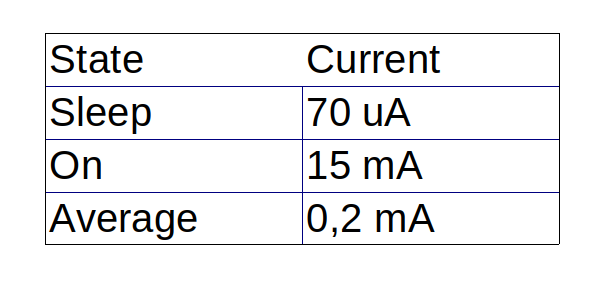
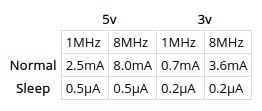

# ATtiny85 OLED Thermometer
## Summary
This example shows the implementation for an OLED display, DHT22 thermometer and the usage of sleep for low power consumption.
The parameters shown are temperature, humidity and heat index.

The libraries required are:
- [DHT sensor library](https://github.com/adafruit/DHT-sensor-library/) from Adafruit.
- [Tiny4kOLED](https://github.com/datacute/Tiny4kOLED/) from datacute. 

## How it works

As described above, the program basically runs on a loop but most of the time it is under the sleep state. As soons as an interrupt is triggered the program reads the DHT sensor and holds the information on screen for 5 seconds. Then it resumes the sleep state until the next interrupt.

## Circuit

Two main circuits are necessary. One circuit to program the ATtiny and another one for the thermometer itself.

The capacitor on the Arduino's reset pin is only necessary while programming the ATtiny. It must be taken off when loading the Arduino with the Arduino as ISP sketch.

DHT sensor is connected on pin 4 of the ATtiny (pinout provided below). The SDA and SCL pins use pin 0 and 2 of the ATtiny respectively.

ATtiny85 pinout (source https://github.com/SpenceKonde/ATTinyCore)

## Programming
- Use SpenceKonde ATTinycore board
- Board must be configured without BOD or bootloader. Also, 8MHz clock speed is recommended for proper I2C communication.

## Results
- Power consumption is very low. Avereage current is 200uA. .
- Energy consumption results defer from [Technoblogy](http://www.technoblogy.com/show?KX0&fbclid=IwAR0qujeHHnLwCLaDrUGe500OKDWC_zPyXkE4ueqHWGD06zeFv5_O4Y1dK-k) results. It could be due to the fact that the OLED and DHT are not disconnected from power bus. It could be resolved by powering them from the left free pin.

## Updates
- Device has been running for more than 6 months of uninterrupted discharge. It is not used very often, maybe once or twice a day, but the battery still holds enough charge for the ATtiny and periphericals to operate. During design I estimated a maximum charge-life of 2 years if not used. I would be not amazed if it survives another 6 or 12 months until the Lithium battery dies by self discharge.
